# Orvella


| Layer      | Technology                       |
| ---------- | -------------------------------- |
| Backend    | Go (Gin Framework)               |
| Web App    | Laravel (PHP / Blade)            |
| Mobile App | React Native (Expo)              |
| Database   | MySQL / PostgreSQL               |
| AI Service | External API (Cloudflare Tunnel) |
| Auth       | Token-based Authentication       |
| Testing    | Postman                          |

---

## 🅰System Architecture (LO1)

### Use Case Diagram

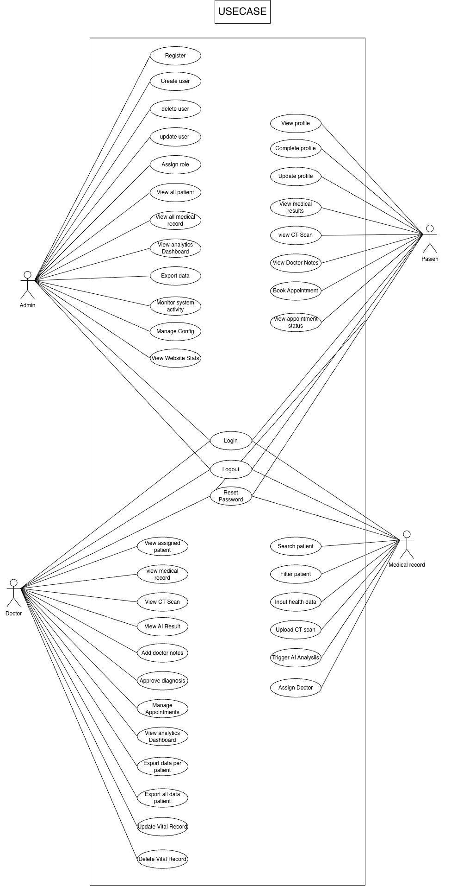

**Actors:**

* Admin
* Doctor
* Medrec
* Patient

---

### Class Diagram

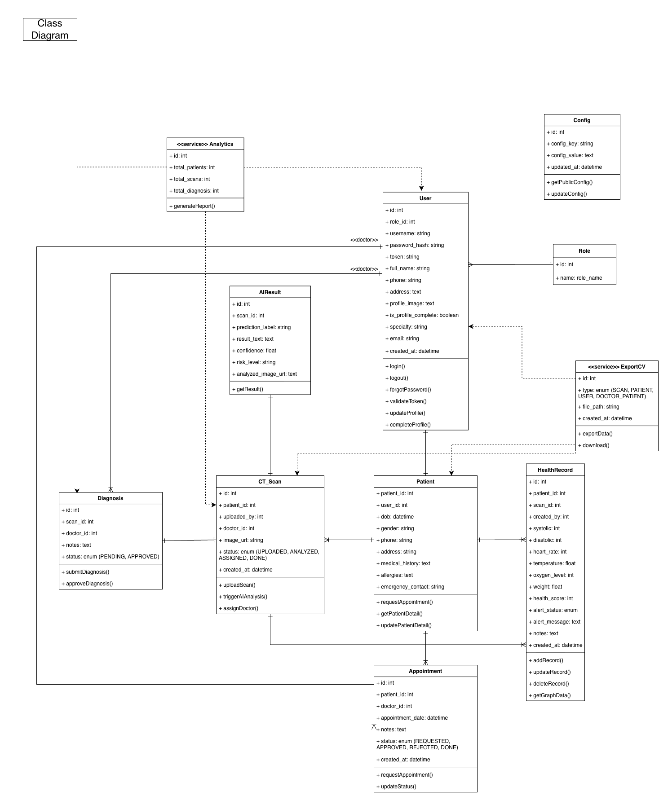

---

### ERD

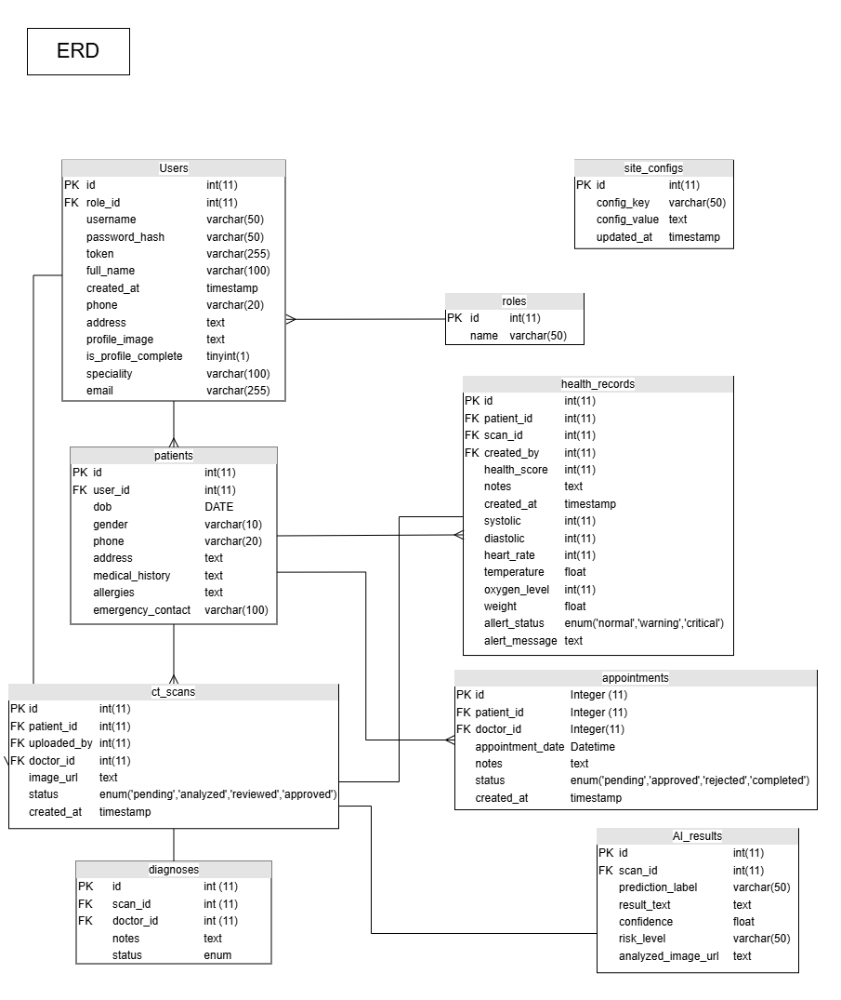

---

---

## REST API (LO2)

### Base URL

```bash
http://localhost:8080
```

---
### AI Service Integration

**Get AI API**

- Endpoint  
     GET https://api-heat-alike-flashing.trycloudflare.com  

- Deskripsi  
     Digunakan untuk memastikan bahwa layanan AI aktif dan dapat diakses.

---

- Response
```json
{
  "message": "AI service is running"
}
```

- Screenshot
     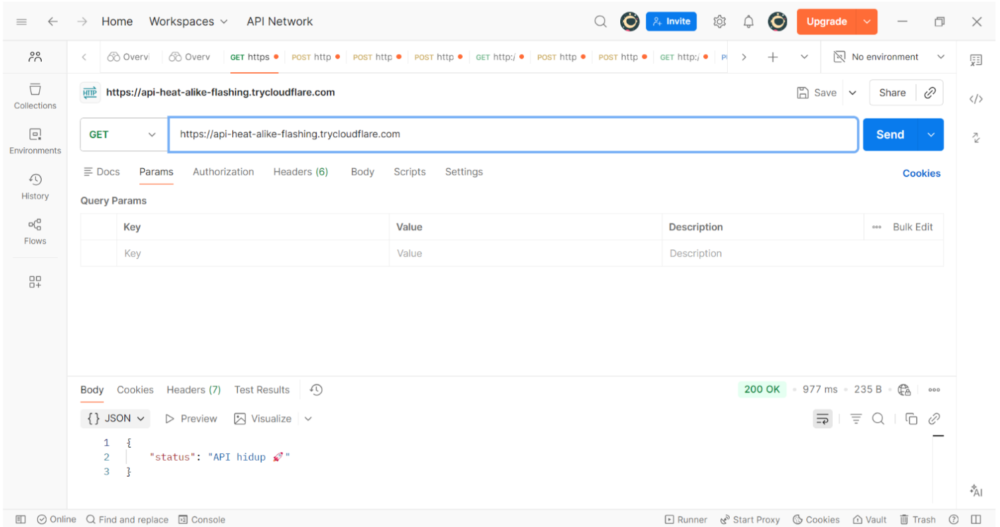

**CT Scan Analysis (AI Prediction)**

- Endpoint  
     POST https://api-heat-alike-flashing.trycloudflare.com/predict

- Deskripsi  
     Digunakan untuk mengirim data CT Scan ke AI dan mendapatkan hasil analisis berupa prediksi penyakit beserta tingkat kepercayaannya.

- Request (form-data)
     file: 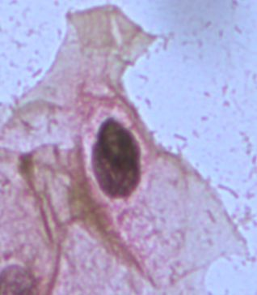

- Response
```json
{
  "class": "Koilocytotic",
  "index": 1,
  "confidence": 0.9999206066131592
}
```

- Screenshot
     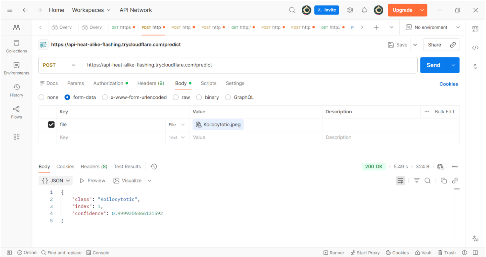

### 🔐 Authentication

| Endpoint  | Method | Description      |
| --------- | ------ | ---------------- |
| `/login`  | POST   | Login user       |
| `/logout` | POST   | Logout user      |
| `/me`     | GET    | Get current user |


**Login**
- Endpoint  
     POST /login => http://localhost:8080/login

- Deskripsi  
     Digunakan untuk melakukan login user dan mendapatkan token yang akan digunakan untuk autentikasi pada endpoint lainnya.

## 👤 Login sebagai Admin

- Request
     ```json
     {
     "username": "admin",
     "password": "admin123"
     }
     ```
- Response
     ```json
     {
     "token": "224e2f34-acf3-4699-9afc-870bd49098e"
     }
     ```
- Screenshot
     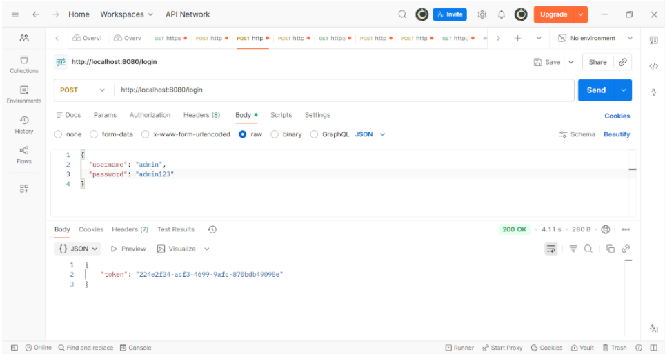

👨‍⚕️ Login sebagai Doctor
- Request
```json
     {
     "username": "dr_tirta",
     "password": "doctor123"
     }
```
- Response
```json
     {
     "token": "176d4667-d51d-4685-874f-578d36419095"
     }
```
- Screenshot
     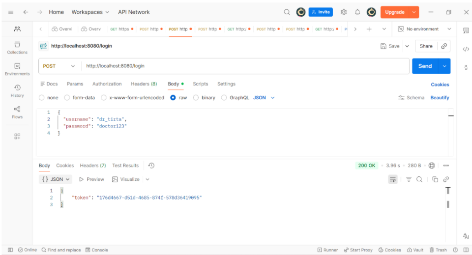

👨‍⚕️ Login sebagai Medrec
- Request
```json
     {
     "username": "medrec_budi",
     "password": "medrec123"
     }
```
- Response
```json
     {
     "token": "6c98d52d-d9f1-43d1-8ba9-a019ce5ee55b"
     }
```
- Screenshot
              

👨‍⚕️ Login sebagai Patient
- Request
```json
     {
     "username": "Haha1234",
     "password": "Haha1234"
     }
```
- Response
```json
     {
     "token": "d456312f-484f-4fc0-acf6-8f45eb7287d3"
     }
```
- Screenshot
     


**Logout**

- Endpoint  
     POST /logout => http://localhost:8080/logout

- Deskripsi  
     Digunakan untuk mengakhiri sesi login user (logout) dari sistem.

- Header  
     "Authorization": "Bearer <d456312f-484f-4fc0-acf6-8f45eb7287d3>" => token dari login user

- Response
```json
{
  "message": "Logout successful"
}
```
- Screenshot
1. 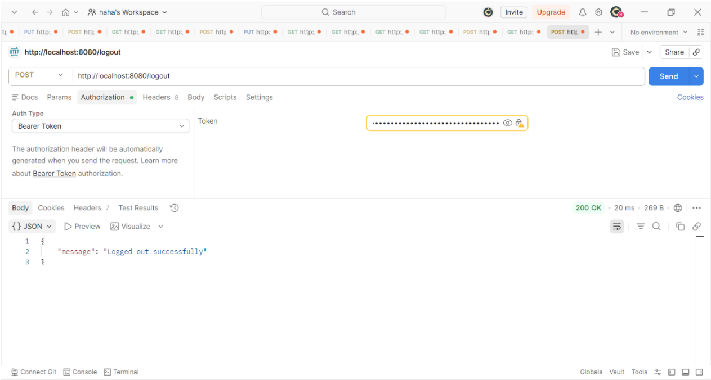
2. 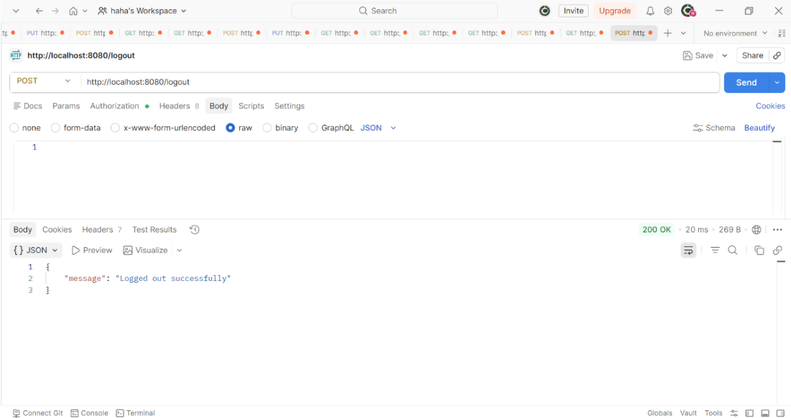

**Get Current User**
- Endpoint  
     GET /me => http://localhost:8080/me

- Deskripsi  
     Digunakan untuk mendapatkan informasi atau data user yang sedang login berdasarkan token yang diberikan.

- Header  
     "Authorization": "Bearer <6c98d52d-d9f1-43d1-8ba9-a019ce5ee55b>" => token dari login medical record

- Response
```json
     {
     "user": {
          "id": 12,
          "role_id": 4,
          "role_name": "Medical Record",
          "username": "medrec_budi",
          "full_name": "Budi Staff RM",
          "is_profile_complete": true,
          "created_at": "0001-01-01T00:00:00Z"
     }
     }
```
- Screenshot
1. 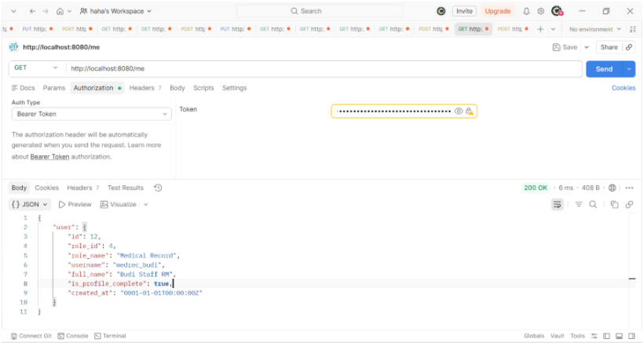
2. 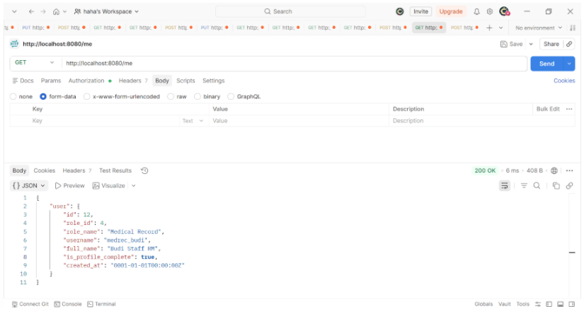

---

### 👤 User Management

| Endpoint    | Method | Role  |
| ----------- | ------ | ----- |
| `/register` | POST   | Admin |

- Endpoint  
     POST /register => http://localhost:8080/register

- Deskripsi  
     Digunakan oleh admin untuk mendaftarkan user baru ke dalam sistem.

- Header  
     "Authorization": "Bearer <cf6018ae-9fd4-40af-8649-a4c5a4514869> => token dari admin

- Screenshot
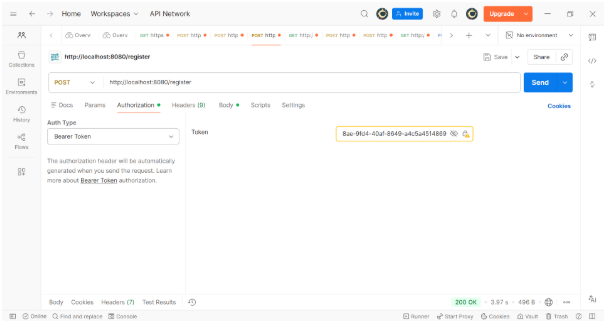

👨‍⚕️ Register sebagai Doctor
- Screenshot
1. 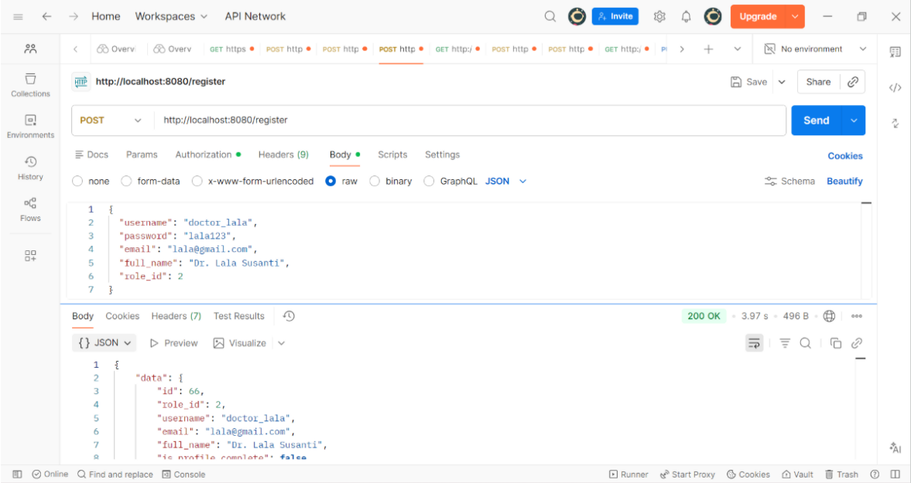
2. 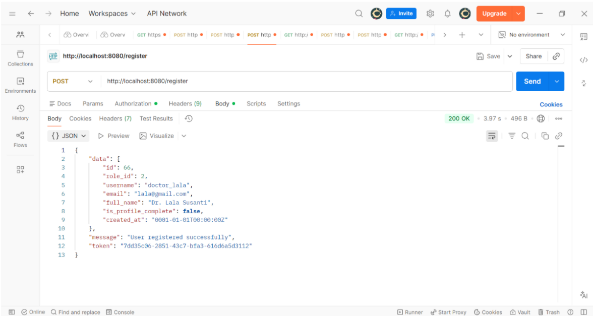

👨‍⚕️ Register sebagai Medical Record
- Screenshot
1. 
2. 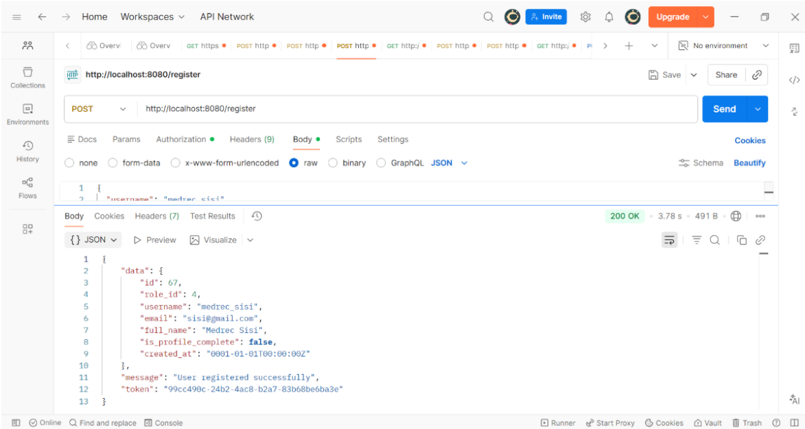

👨‍⚕️ Register sebagai Patient
- Request
```json
     {
          "role_id": 3,
          "username": "pasien_baru",
          "email": "pasien@example.com",
          "password": "password123",    
          "full_name": "Budi Santoso",
          "phone": "081234567890",
          "address": "Jl. Merdeka No. 123, Jakarta Selatan",
          "date_of_birth": "1995-05-20",
          "gender": "Male",
          "emergency_contact": "081333444555",
          "medical_history": "Tidak ada riwayat penyakit berat",
          "allergies": "Alergi debu dan seafood"
     }
```

- Response
```json
{
    "data": {
        "id": 79,
        "role_id": 3,
        "username": "pasien_baru",
        "email": "pasien@example.com",
        "full_name": "Budi Santoso",
        "phone": "081234567890",
        "address": "Jl. Merdeka No. 123, Jakarta Selatan",
        "is_profile_complete": false,
        "created_at": "0001-01-01T00:00:00Z"
    },
    "message": "User registered successfully",
    "token": "56e0e09b-736a-4e84-88c3-41a1f63c3693"
}
```
- Screenshot
1. 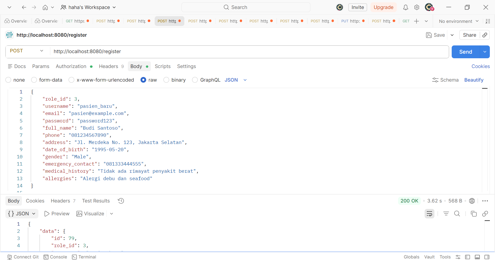
2. 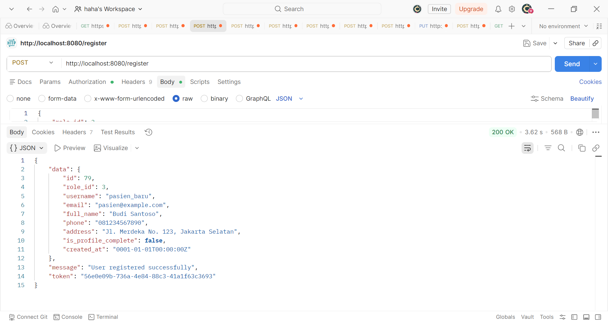

### 🔐 Authentication & Config

| Endpoint             | Method | Description                |
|----------------------|--------|----------------------------|
| `/forgot-password`   | POST   | Request reset password     |
| `/configs`           | GET    | Get public configuration   |
| `/configs`           | PUT    | Update landing page        |

**Forgot Password**

- Endpoint  
     POST /forgot-password => http://localhost:8080/forgot-password

- Deskripsi  
     Digunakan untuk mengirim permintaan reset password. Sistem akan memproses email user dan mengirimkan instruksi untuk mengganti password.

- Request
     ```json
     {
     "username": "Thienn",
     "password": "Thien123@"
     }
     ```
- Response
     ```json
     {
     "message": "Password updated successfully. Access node Thienn restored"
     }
     ```
- Screenshot
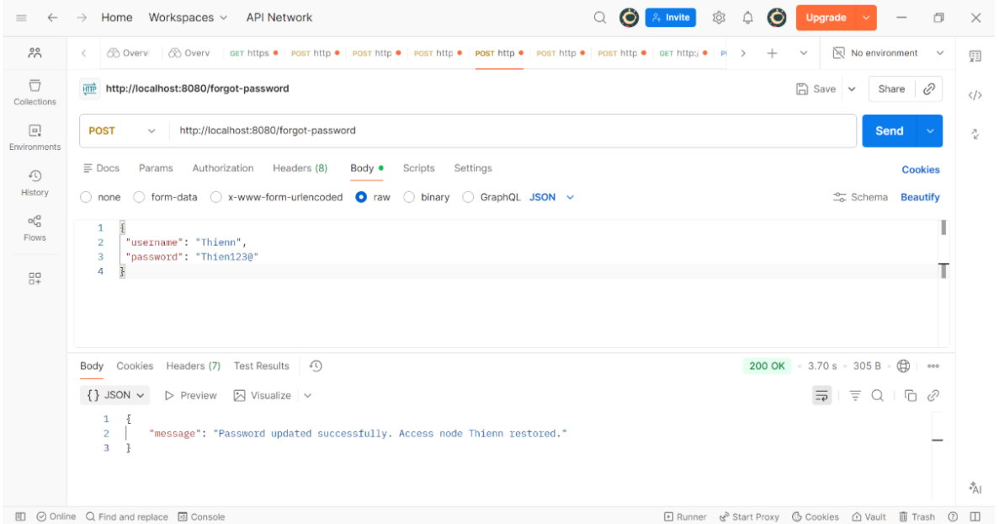

**Get Public Configs**

- Endpoint  
     GET /configs => http://localhost:8080/configs

- Deskripsi  
     Digunakan untuk mengambil konfigurasi publik dari sistem, seperti konten landing page atau pengaturan umum yang dapat diakses tanpa autentikasi.

- Response
```json
     {
     "data": {
          "contact_address": "Cyberpark Tower, Lt 12\nJakarta Selatan, 12950",
          "contact_email": "admin@orvella.ai",
          "contact_phone": "+62 821-2345-6789",
          "hero_image": "/images/hero.png",
          "hero_subtitle": "Platform modern yang menggabungkan kecerdasan buatan dan validasi medis profesional untuk deteksi CT Scan dan pemantauan kondisi pasien.",
          "hero_title": "Next-Gen Oncology AI",
          "stats_accuracy": "99.9%",
          "stats_doctors": "150+",
          "stats_patients": "10K+",
          "stats_scans": "45K+"
     }
     }
```
- Screenshot
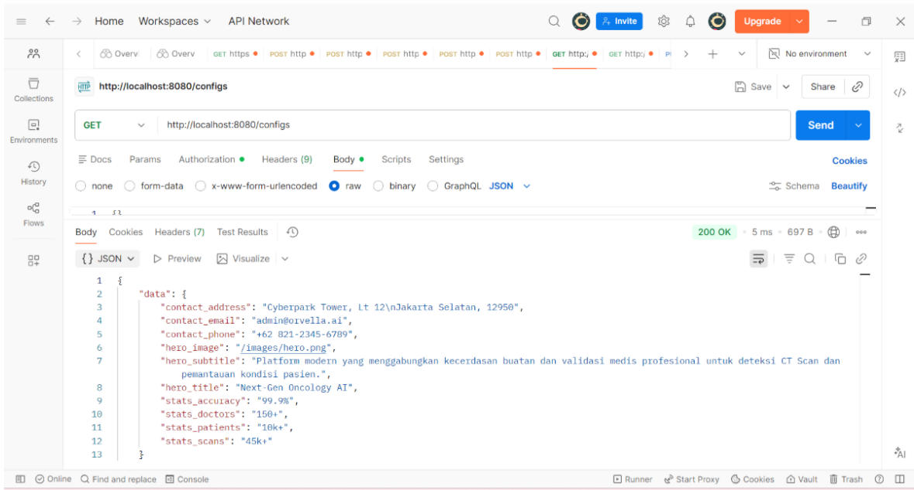
---

**Update Landing Page**

- Endpoint  
     PUT /configs => http://localhost:8080/configs

- Token  
     "Authorization": "Bearer <5c6ceede-dc23-438b-bfe1-28a62a648dac> => token dari admin

- Header  
     "Authorization": "Bearer <5c6ceede-dc23-438b-bfe1-28a62a648dac> => token dari admin

- Request
```json
     {
     "configs": {
          "hero_title": "Next-Gen Oncology AI",
          "stats_accuracy": "99.9%",
          "contact_email": "admin@orvella.ai"
     }
     }
```

- Response
```json
     {
          "message": "Configurations updated successfully"
     }
```
- Screenshot
1. 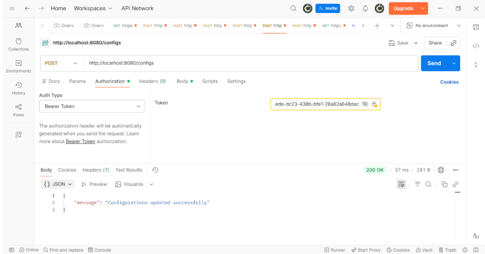
2. 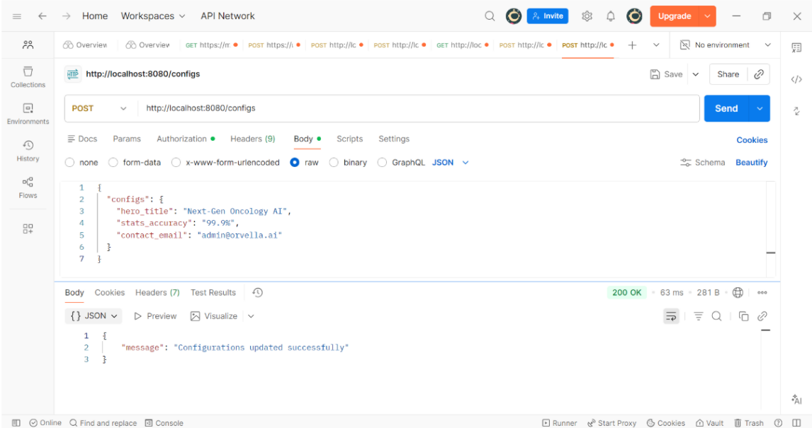
---

### 🧠 CT Scan & AI

| Endpoint              | Method | Description    |
| --------------------- | ------ | -------------- |
| `/scans`              | POST   | Upload CT Scan |
| `/scans/{id}/analyze` | POST   | Trigger AI     |

**Upload CT Scan**

- Endpoint  
     POST /scans => http://localhost:8080/scans

- Deskripsi  
     Digunakan untuk mengupload file CT Scan milik pasien ke dalam sistem. Data ini akan disimpan dan digunakan sebagai input untuk proses analisis AI.
- Header  
     "Authorization": "Bearer <df5ce6fd-71f6-4572-8c1b-27bf57dc2b5d>" => token dari login medical record

- Request
```json
     {
     "patient_id": 2,
     "file": "File CT Scan"
     }
```
     File yang digunakan : 
- Response 
```json
     {
     "data": {
          "id": 39,
          "patient_id": 2,
          "uploaded_by": 12,
          "image_url": "uploads/ct_scans/1776438735927524000_WhatsApp Image 2026-04-13 at 15.51.21.jpeg",
          "status": "pending",
          "created_at": "0001-01-01T00:00:00Z"
     },
     "message": "Scan uploaded successfully"
     }
```
- Screenshot
1. 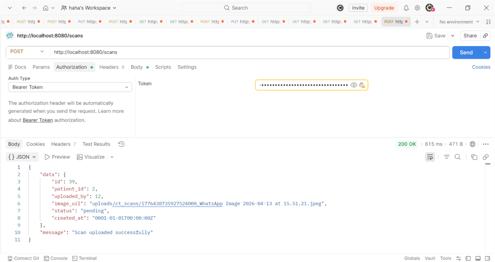
2. 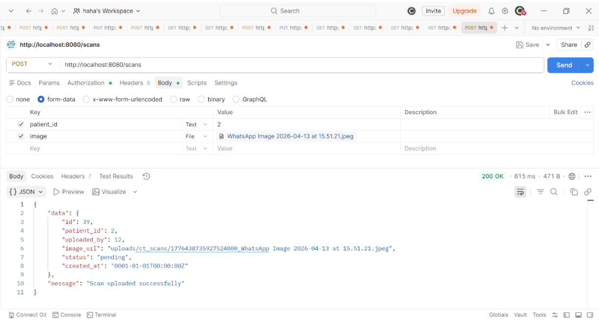

---

**Trigger AI Analysis**

- Endpoint  
     POST /scans/{id}/analyze => http://localhost:8080/scans/1/analyze

- Deskripsi  
     Digunakan untuk memproses CT Scan yang telah diupload menggunakan AI. Sistem akan mengirim data ke layanan AI dan mengembalikan hasil berupa prediksi penyakit beserta tingkat kepercayaannya.

- Header  
     "Authorization": "Bearer <54659bdb-3948-4ed4-9752-ebf67c82a937>" => token dari login medical record

- Response
```json
     {
     "data": {
          "id": 29,
          "scan_id": 1,
          "prediction_label": "Koilocytotic",
          "result_text": "Koilocytotic changes identified (suggestive of HPV infection).",
          "confidence": 0.8039395441740891,
          "risk_level": "Follow-up with HPV DNA testing and secondary screening.",
          "analyzed_image_url": ""
     },
          "message": "Scan AI result recorded"
     }
```
- Screenshot
1. 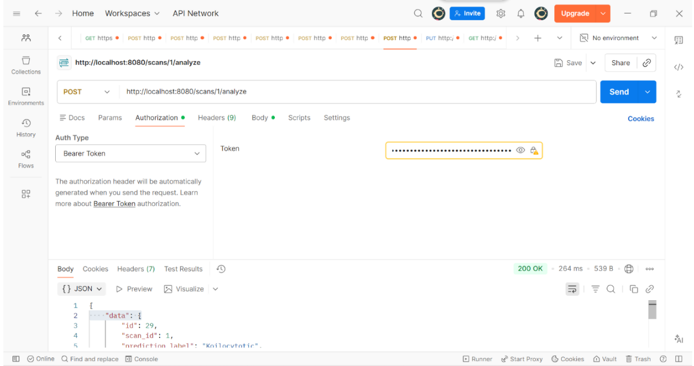
2. 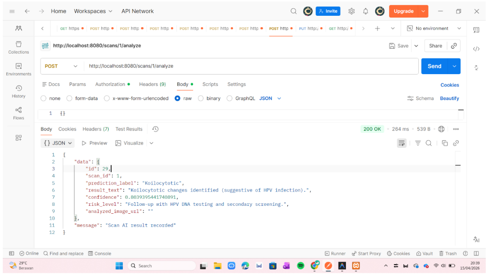
---

### 👨‍⚕️ Medical Workflow

| Endpoint                    | Method | Description             |
| --------------------------- | ------ | ------------------------|
| `/scans/{id}/assign-doctor` | POST   | Assign doctor to scan   |
| `/diagnosis`                | POST   | Create diagnosis        |
| `/diagnosis/{id}/approve`   | POST   | Approve diagnosis       |

---

**Assign Doctor**
- Endpoint  
     POST /scans/{id}/assign-doctor => http://localhost:8080/scans/1/assign-doctor

- Deskripsi  
     Digunakan untuk menetapkan dokter yang bertanggung jawab dalam menangani hasil CT Scan pasien.

- Header  
     "Authorization": "Bearer <6c20b1bb-c712-4ac2-a362-127190614654>" => token dari login medical record

- Request
```json
     {
     "doctor_id": 1
     }
```
- Response
```json
     {
          "message": "Doctor assigned successfully"
     }
```
- Screenshot
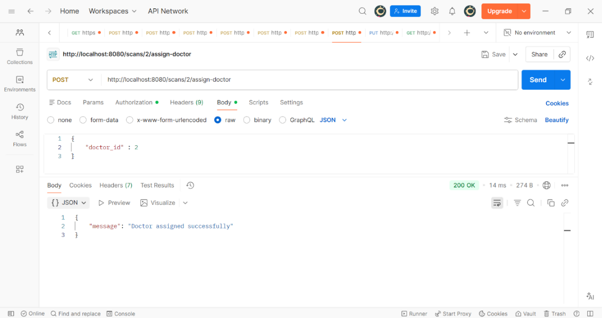

---

**Submit Diagnosis**

- Endpoint  
     POST /diagnosis => http://localhost:8080/diagnosis

- Deskripsi  
Digunakan oleh dokter untuk memasukkan hasil diagnosis berdasarkan analisis CT Scan dan pertimbangan medis.

- Header  
     "Authorization": "Bearer <c64b0faf-937d-4523-b5fc-c2cf907df593>" => token dari login dokter

- Request
```json
     {
     "scan_id": 1,
     "diagnosis_result": "Positive - Low Grade",
     "notes": "Suggest immediate follow-up in 3 months."
     }
```
- Response
```json
     {
     "data": {
          "id": 12,
          "scan_id": 1,
          "doctor_id": 11,
          "notes": "Suggest immediate follow-up in 3 months.",
          "status": "draft"
          },
          "message": "Diagnosis draft created"
     }
```
- Screenshot
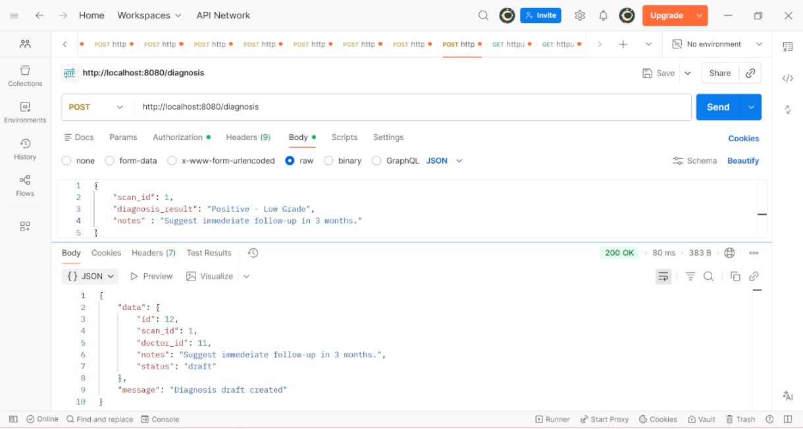

---

**Approve Diagnosis**

- Endpoint 
     POST /diagnosis/{id}/approve => http://localhost:8080/diagnosis/1/approve

- Deskripsi  
     Digunakan oleh dokter untuk melakukan verifikasi dan persetujuan terhadap hasil diagnosis sebelum ditampilkan kepada pasien.

- Header  
     "Authorization": "Bearer <b48066a-0944-4673-ba8c-360ec55029df>" => token dari login dokter

- Request
```json
     {
          "scan_id": 1
     }
```
- Response
```json
     {
          "message": "Diagnosis and Scan approved"
     }
```
- Screenshot
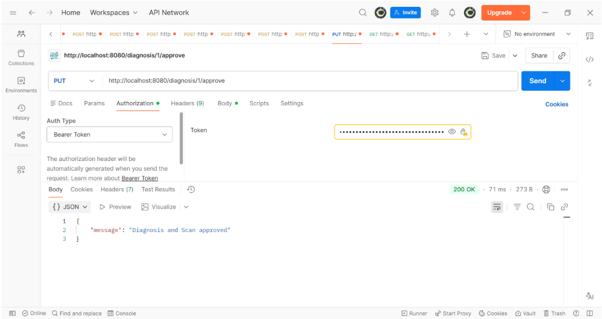
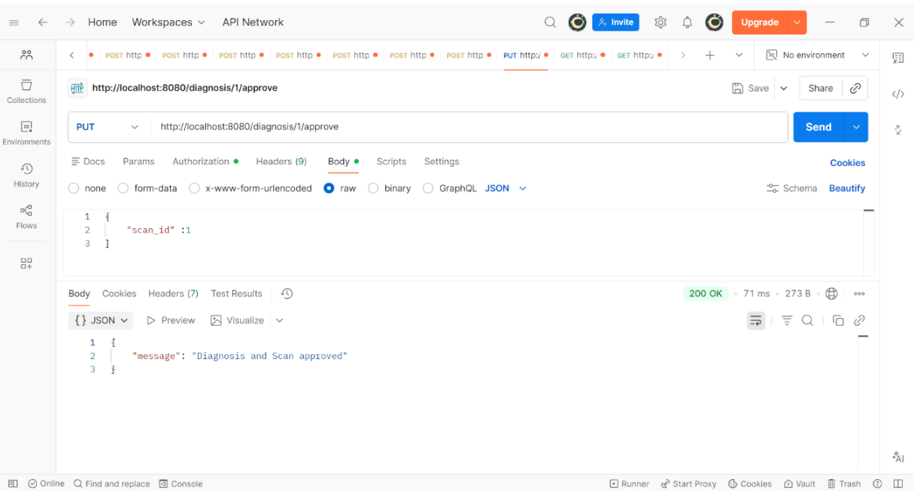

---

### 🏥 Health Records

| Endpoint                | Method | Description             |
| ----------------------- | ------ | ----------------------- |
| `/health-records`       | POST   | Add Health Record       |
| `/health-records/graph` | GET    | Get Health Graph        |

---

**Add Health Record**

- Endpoint  
     POST /health-records => http://localhost:8080/health-records

- Deskripsi  
     Digunakan untuk menyimpan data kesehatan pasien, seperti hasil diagnosis, tekanan darah, atau data medis lainnya.

- Header  
     "Authorization": "Bearer <d967bbeb-489e-4378-bc0f-76c060da98fc>" => token dari login medical record atau doctor

- Request
```json
     {
          "patient_id": 3,
          "systolic": 115,
          "diastolic": 75,
          "heart_rate": 68,
          "weight": 70,
          "blood_sugar": 92,
          "notes": "Post-diagnostic baseline."
     }
```
- Response
```json
     {
          "message": "Record created successfully"
     }
```
- Screenshot
1. 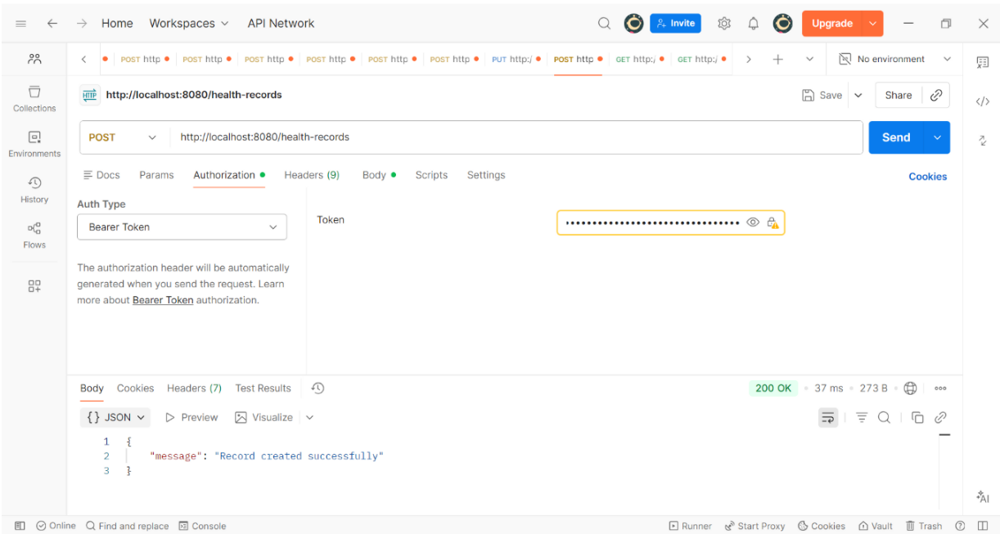
2. 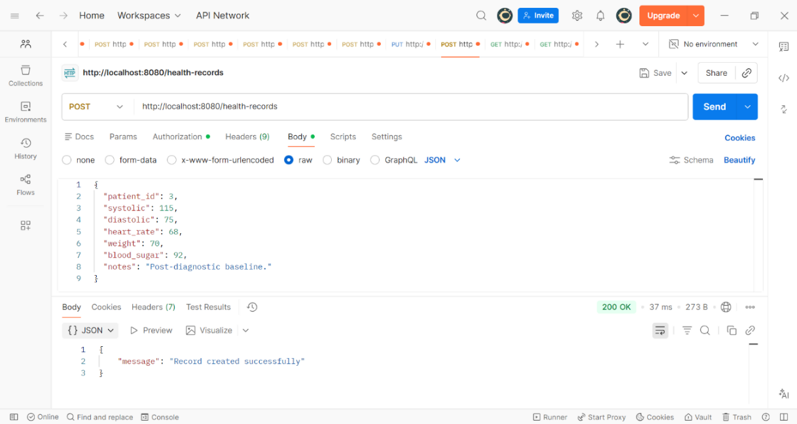

---

**Get Health Graph**

- Endpoint  
     GET /health-records/graph => http://localhost:8080/health-records/graph

- Deskripsi  
     Digunakan untuk mengambil data kesehatan pasien dalam bentuk yang dapat divisualisasikan (grafik), sehingga memudahkan monitoring kondisi pasien dari waktu ke waktu.

- Header  
     "Authorization": "Bearer <31597333-b73d-47f8-b38c-053ea6c659da>" => token dari login pasien

- Response
```json
     {
          "data": [
               {
                    "id": 54,
                    "patient_id": 8,
                    "scan_id": 35,
                    "created_by": 12,
                    "systolic": 90,
                    "diastolic": 89,
                    "heart_rate": 90,
                    "temperature": 37,
                    "oxygen_level": 90,
                    "weight": 78,
                    "health_score": 75,
                    "alert_status": "warning",
                    "alert_message": "Kondisi peringatan: skor menengah.",
                    "notes": "Automated entry via clinical pipeline",
                    "created_at": "2026-04-15T01:14:27Z"
               },
               {
                    "id": 53,
                    "patient_id": 8,
                    "scan_id": 34,
                    "created_by": 12,
                    "systolic": 120,
                    "diastolic": 80,
                    "heart_rate": 88,
                    "temperature": 37,
                    "oxygen_level": 99,
                    "weight": 80,
                    "health_score": 100,
                    "alert_status": "normal",
                    "alert_message": "Semua indikator kesehatan normal.",
                    "notes": "Automated entry via clinical pipeline",
                    "created_at": "2026-04-15T01:13:51Z"
               }
          ]
     }
```
- Screenshot
1. 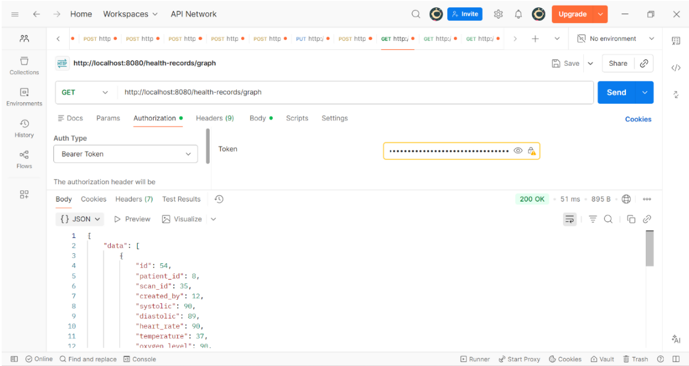
2. 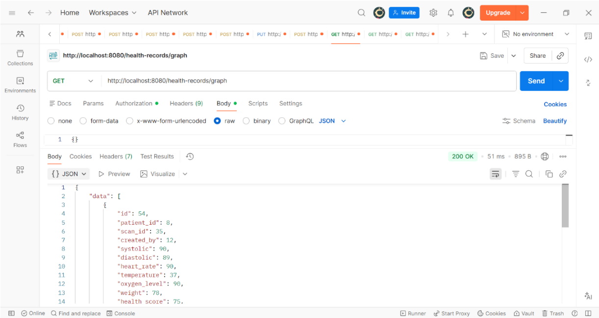
3. 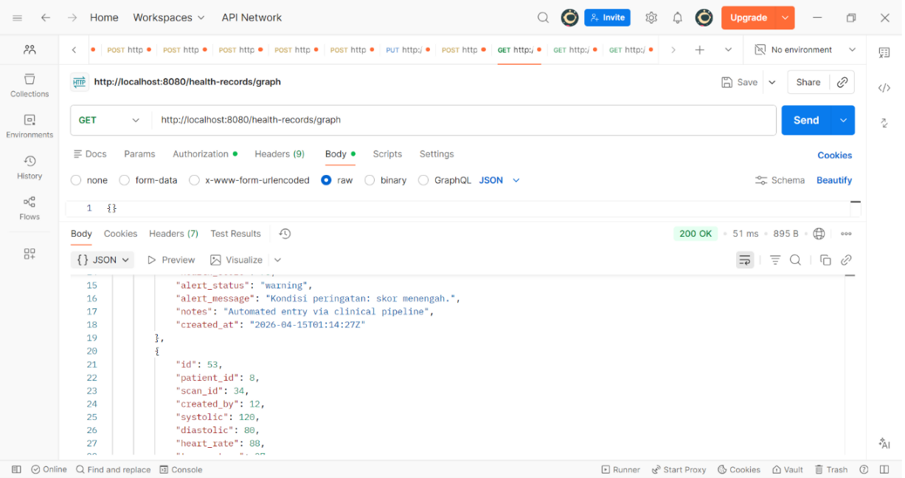
4. 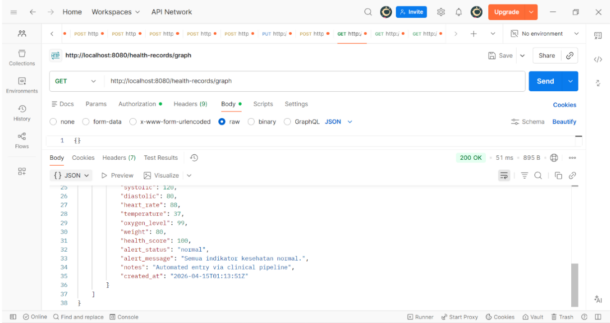
---

### 📅 Appointment

| Endpoint                    | Method | Description                 |
| --------------------------- | ------ | --------------------------- |
| `/appointments`             | POST   | Request Appointment         |
| `/appointments/{id}/status` | PUT    | Update Appointment Status   |

---

**Request Appointment**

- Endpoint  
     POST /appointments => http://localhost:8080/appointments

- Deskripsi  
     Digunakan oleh pasien untuk membuat janji temu dengan dokter pada tanggal tertentu sesuai kebutuhan medis.

- Header  
     "Authorization": "Bearer <c97019a9-a25b-4faa-b031-0069a5b40241>" => token dari login pasien

- Request
```json
     {
          "doctor_id": 2,
          "appointment_date": "2026-06-20T14:00:00Z",
          "notes": "Discussing recent scan results."
     }
```

- Response
```json
     {
          "data": {
               "id": 2,
               "patient_id": 8,
               "doctor_id": 2,
               "appointment_date": "2026-06-20T14:00:00Z",
               "notes": "Discussing recent scan results.",
               "status": "",
               "created_at": "0001-01-01T00:00:00Z"
          },
          "message": "Appointment booked successfully"
     }
```

- Screenshot
1. 
2. 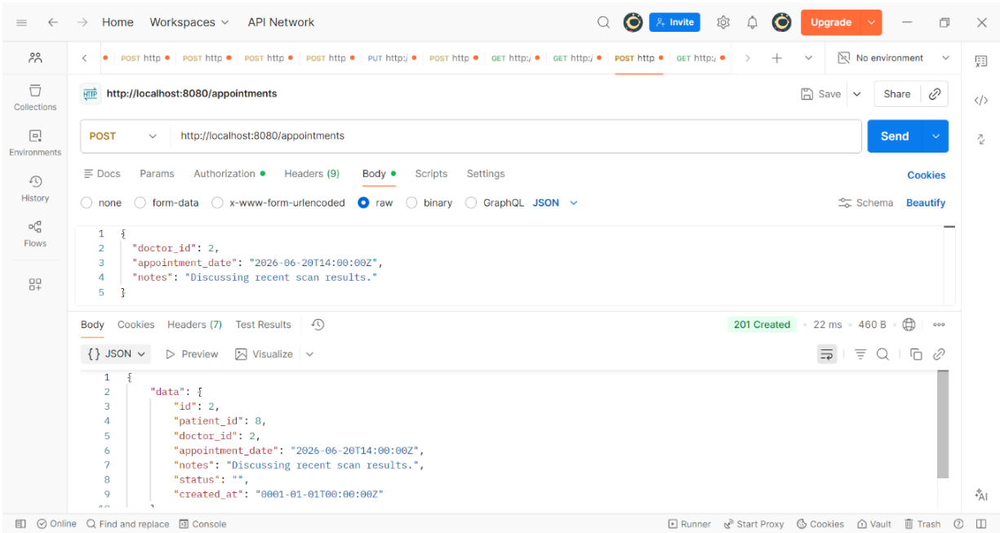
3. 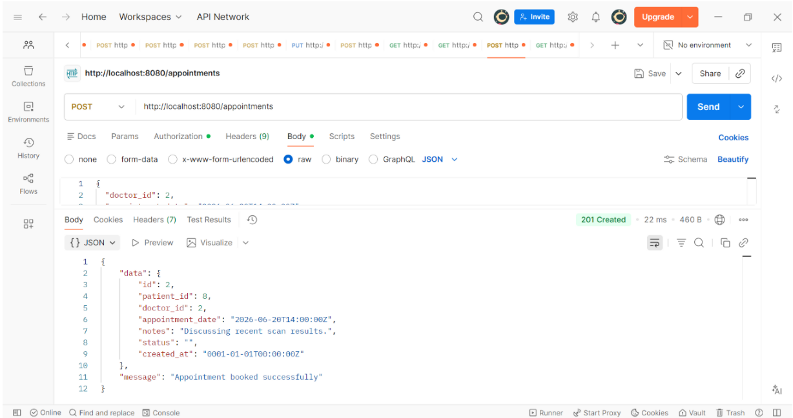

---

**Update Appointment Status**

- Endpoint  
     PUT /appointments/{id}/status  

- Deskripsi  
     Digunakan oleh dokter untuk memperbarui status appointment, seperti menyetujui, menolak, atau menyelesaikan janji temu.

- Header  
     "Authorization": "Bearer <30749ad3-1b4c-4a81-b666-b8a7331472ed>" => token dari login doctor

- Request
```json
     {
          "status": "schedule"
     }
```

- Response
```json
     {
          "message": "Appointment status updated"
     }
```

- Screenshot
1. 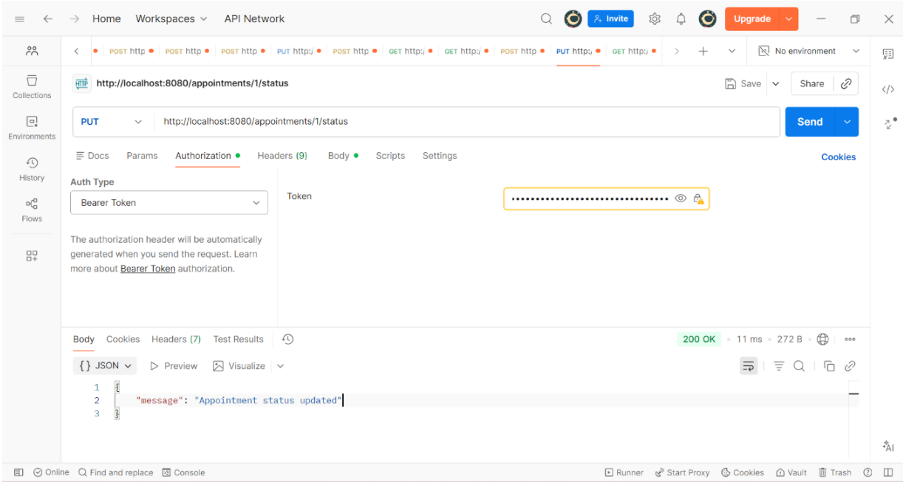
2. 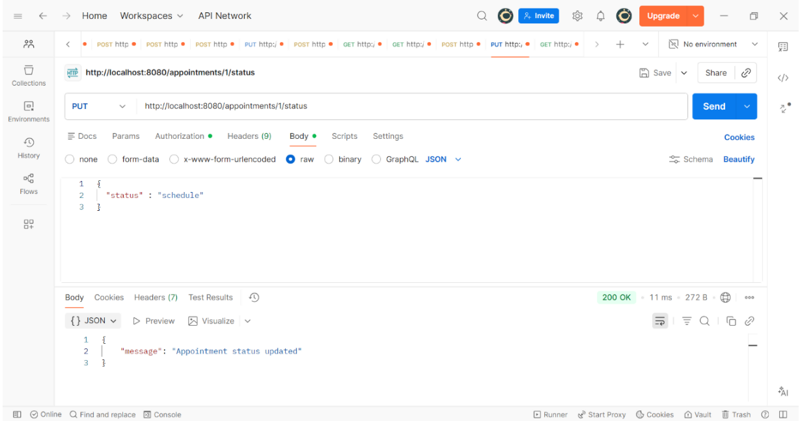
---
### 👤 User Management (Admin Only)

| Endpoint        | Method | Description        |
|----------------|--------|--------------------|
| `/users/{id}`  | PUT    | Edit user data     |
| `/users/{id}`  | DELETE | Delete user        |

---

**Edit User**

- Endpoint  
     PUT /users/{id}  => http://localhost:8080/users/68

- Deskripsi  
     Digunakan oleh admin untuk memperbarui data user berdasarkan ID tertentu, seperti nama lengkap, nomor telepon, dan alamat.

---

- Header   
     "Authorization": "Bearer <118a8a6c-67b3-4c7b-ab6b-314aed81eb83>" => token dari login admin

- Request
```json
     {
          "full_name": "Budi Santoso Update",
          "phone": "081122334455",
          "address": "Alamat baru di Jakarta"
     }
```

- Response
```json
     {
          "message": "User updated successfully"
     }
```

- Screenshot
1. 
2. 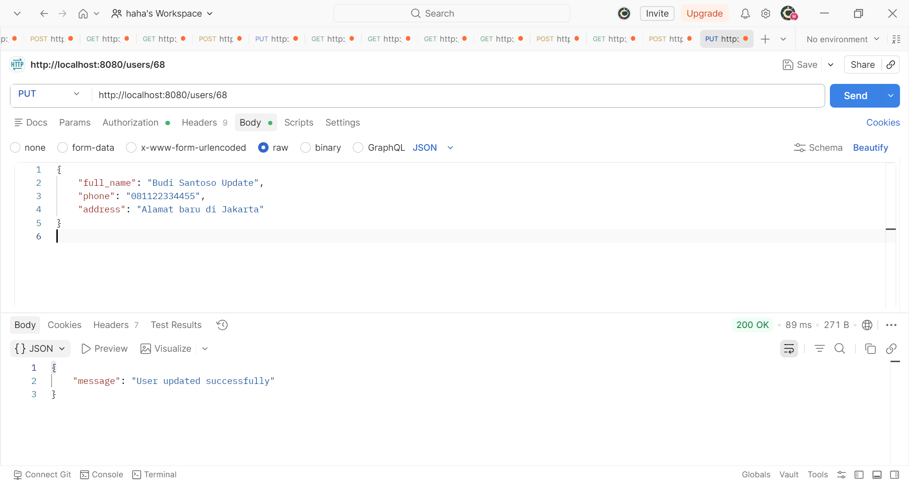
---

**Delete User**

- Endpoint  
     DELETE /users/{id}  => http://localhost:8080/users/68

- Deskripsi  
     Digunakan oleh admin untuk menghapus akun user secara permanen dari sistem.

- Header  
     "Authorization": "Bearer <118a8a6c-67b3-4c7b-ab6b-314aed81eb83>" => token dari login admin

- Request
(No Body)

- Response
```json
{
  "message": "User deleted successfully"
}
```

- Screenshot
1. 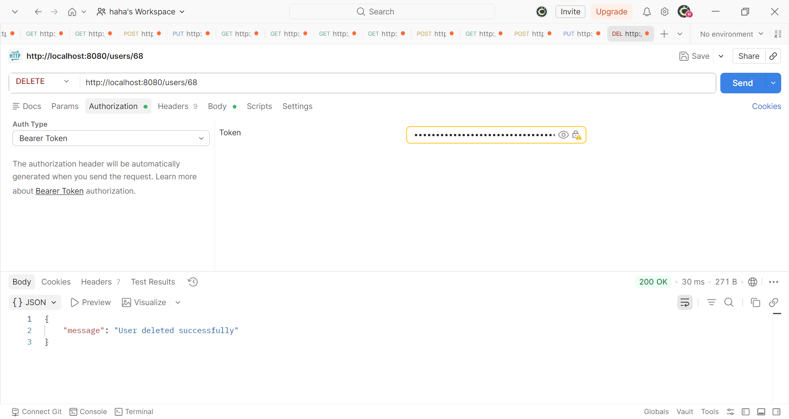
2. 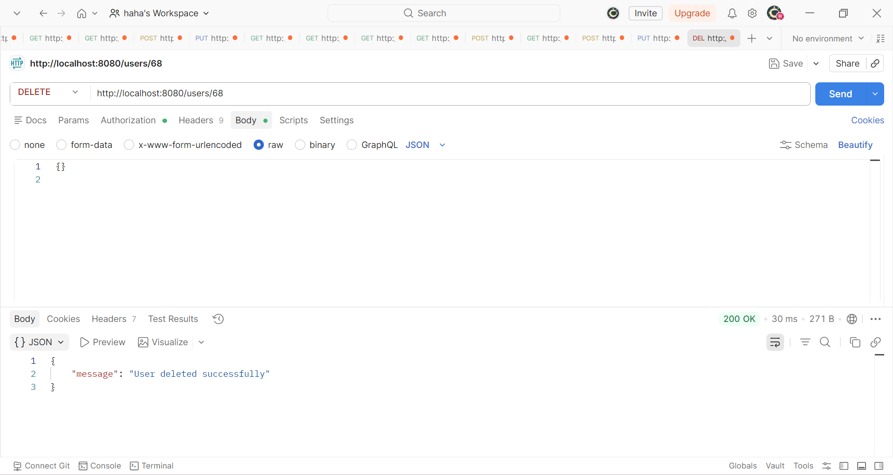
---

### 📊 Analytics

| Endpoint           | Method | Description             |
| ------------------ | ------ | ----------------------- |
| `/analytics/admin` | GET    | Admin Analytics         |

**Admin Analytics**

- Endpoint  
     GET /analytics/admin => http://localhost:8080/analytics/admin

- Deskripsi  
     Digunakan oleh admin untuk melihat data statistik sistem, seperti jumlah pasien, jumlah CT Scan, dan aktivitas lainnya sebagai bahan monitoring dan evaluasi.

- Response
```json
     {
     "data": {
          "patient_growth": [
               {
               "date": "2026-04-09T00:00:00Z",
               "patients": 2
               },
               {
               "date": "2026-04-10T00:00:00Z",
               "patients": 1
               },
               {
               "date": "2026-04-11T00:00:00Z",
               "patients": 3
               },
               {
               "date": "2026-04-15T00:00:00Z",
               "patients": 9
               }
          ],
          "role_distribution": [
               {
               "name": "Admin",
               "value": 3
               },
               {
               "name": "Doctor",
               "value": 5
               },
               {
               "name": "Medical Record",
               "value": 3
               },
               {
               "name": "Patient",
               "value": 15
               }
          ],
          "system_stats": {
               "total_records": 55,
               "total_scans": 35,
               "total_users": 26
          }
     }
     }
```
- Screenshot
1. 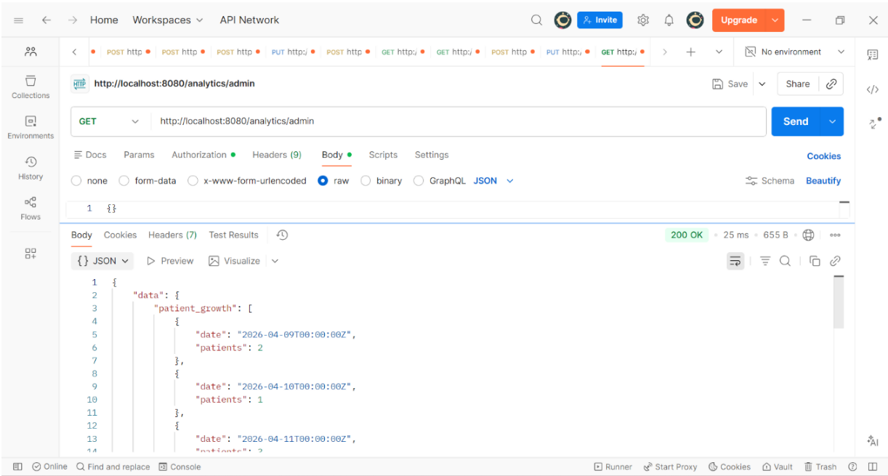
2. 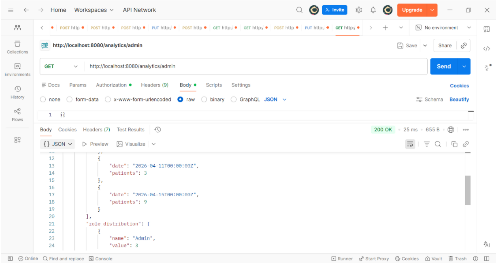
3. 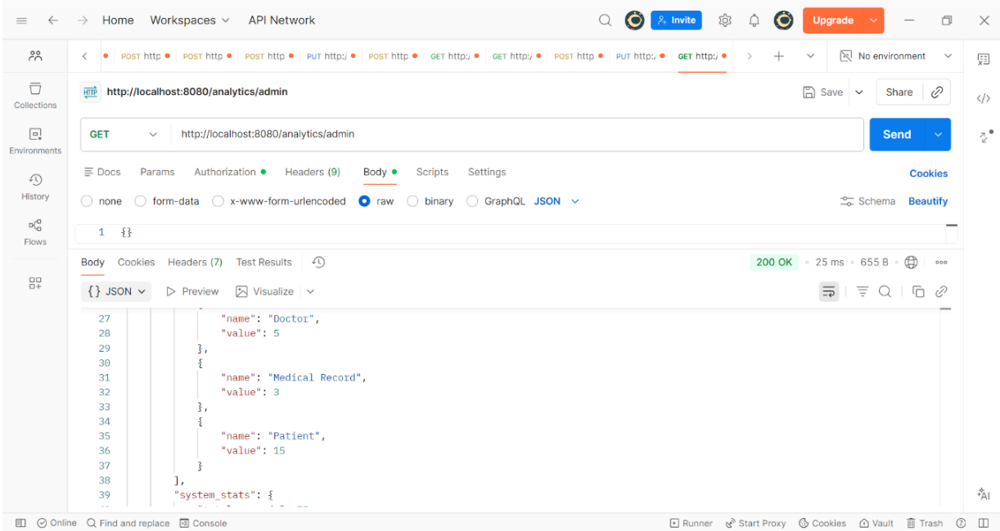
4. 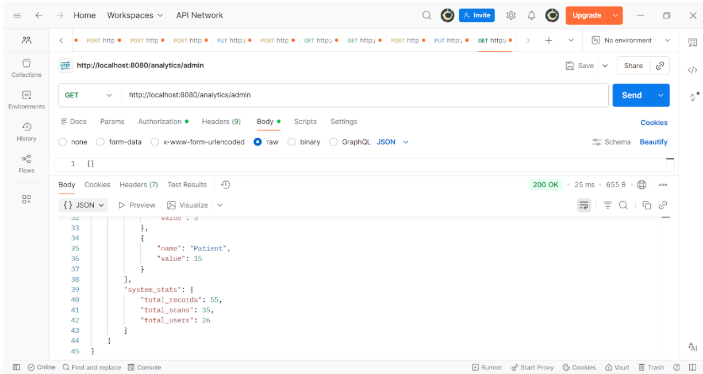

---

### 📁 CSV Export

| Endpoint                  | Method | Description             |
| ------------------------- | ------ | ----------------------- |
| `/export/scans`           | GET    | Export Scans            |
| `/export/patients`        | GET    | Export Patients         |
| `/export/users`           | GET    | Export Users            |
| `/export/patient/{id}`    | GET    | Export Patient          |
| `/export/doctor/patients` | GET    | Export Doctor Patients  |

**Export Scan Data**

- Endpoint  
     GET /export/scans  => http://localhost:8080/export/scans

- Deskripsi  
     Digunakan untuk mengunduh seluruh data CT Scan dalam format CSV.

- Header  
     "Authorization": "Bearer <2ac103eb-8895-4059-81a6-9b5f7db99916>" => token dari login admin

- Screenshot
1. 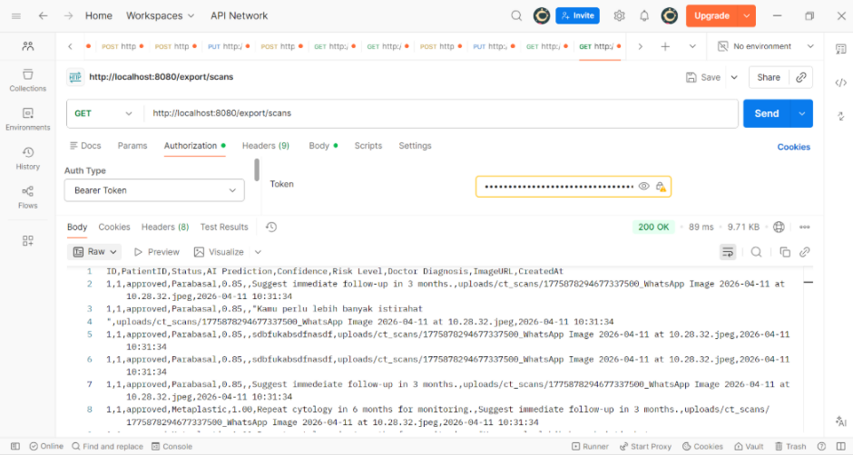
2. 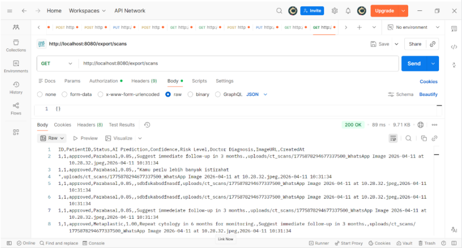

---

**Export Patient Data**

- Endpoint  
     GET /export/patients  => http://localhost:8080/export/patients

- Deskripsi  
     Digunakan untuk mengunduh data seluruh pasien dalam format CSV.

- Header  
     "Authorization": "Bearer <2ac103eb-8895-4059-81a6-9b5f7db99916>" => token dari login admin

- Screenshot
1. 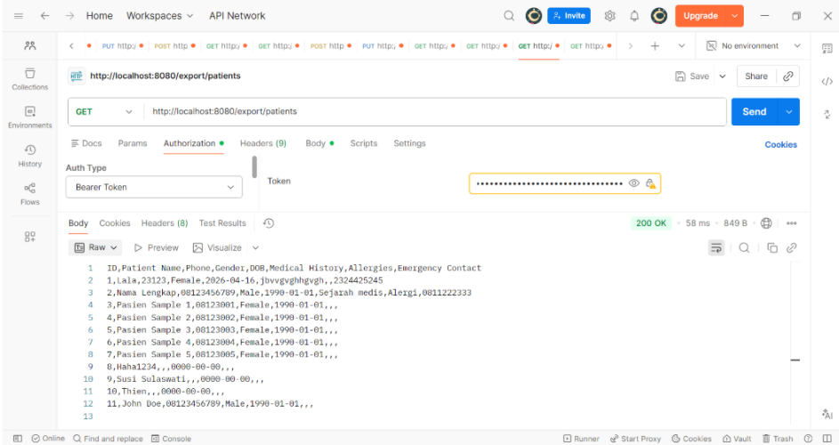
2. 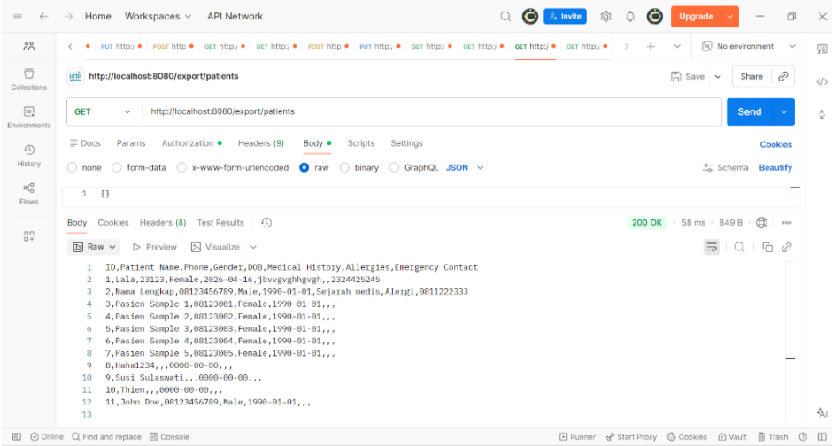
---

**Export User Data**

- Endpoint  
     GET /export/users  => http://localhost:8080/export/users    

- Deskripsi  
     Digunakan untuk mengunduh data seluruh user (Admin, Doctor, Medrec, Patient) dalam format CSV.

- Header  
     "Authorization": "Bearer <2ac103eb-8895-4059-81a6-9b5f7db99916>" => token dari login admin

- Screenshot
1. 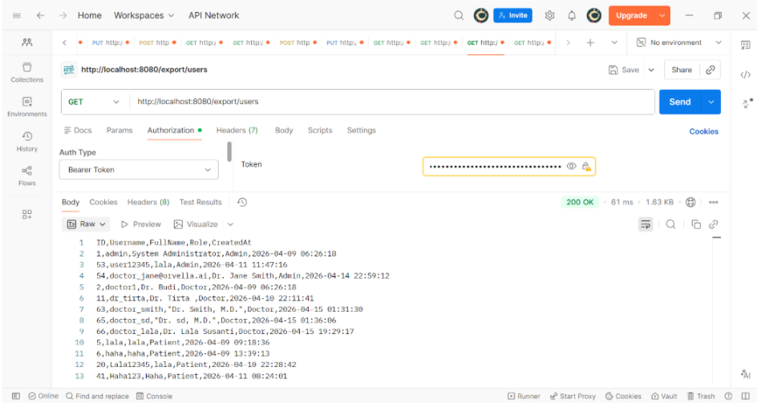
2. 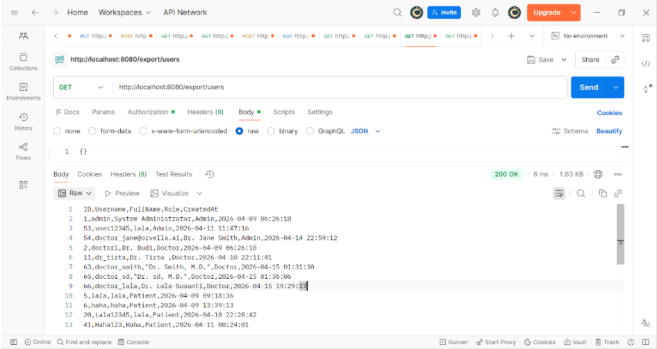
---

**Export Specific Patient**

- Endpoint  
     GET /export/patient/{id}  => http://localhost:8080/export/patient/1

- Deskripsi  
     Digunakan untuk mengunduh data medis dari satu pasien tertentu berdasarkan ID dalam format CSV.

- Header  
     "Authorization": "Bearer <2ac103eb-8895-4059-81a6-9b5f7db99916>" => token dari login doctor

- Screenshot
1. 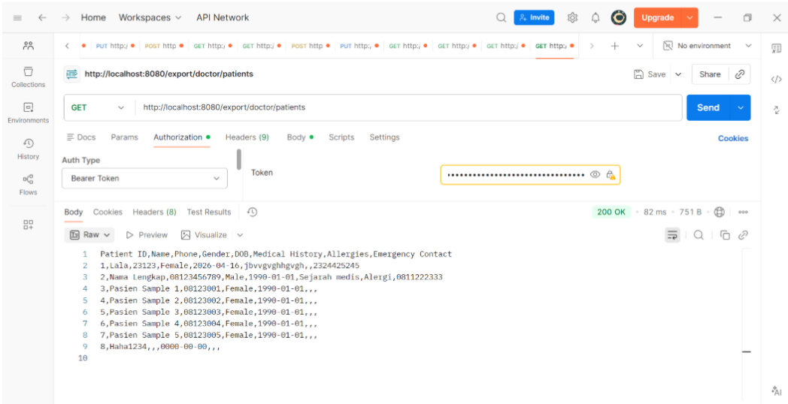
2. 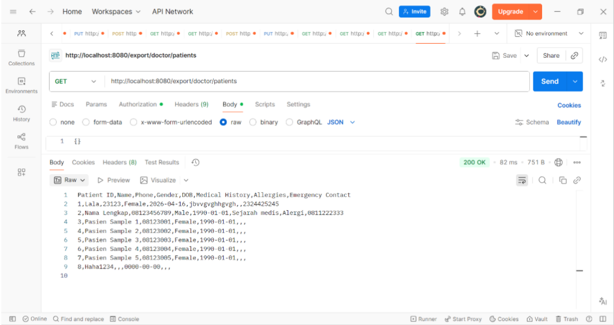
---

**Export All Doctor’s Patients**

- Endpoint  
     GET /export/doctor/patients  => http://localhost:8080/export/doctor/patients

- Deskripsi  
     Digunakan untuk mengunduh data seluruh pasien yang ditangani oleh seorang dokter dalam format CSV.

- Header  
     "Authorization": "Bearer < be6be8fb-9fc0-44d1-acc2-ff3bc508cbec>" => token dari login doctor

- Screenshot
1. 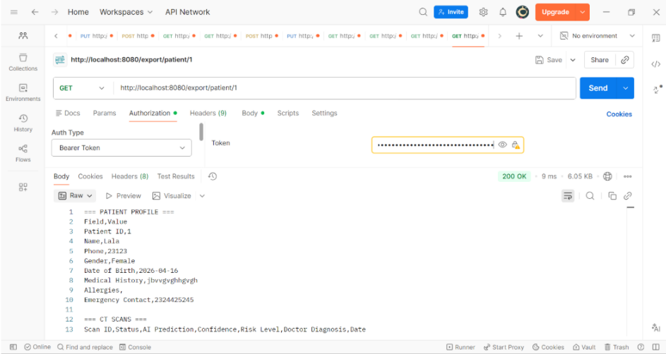
2. 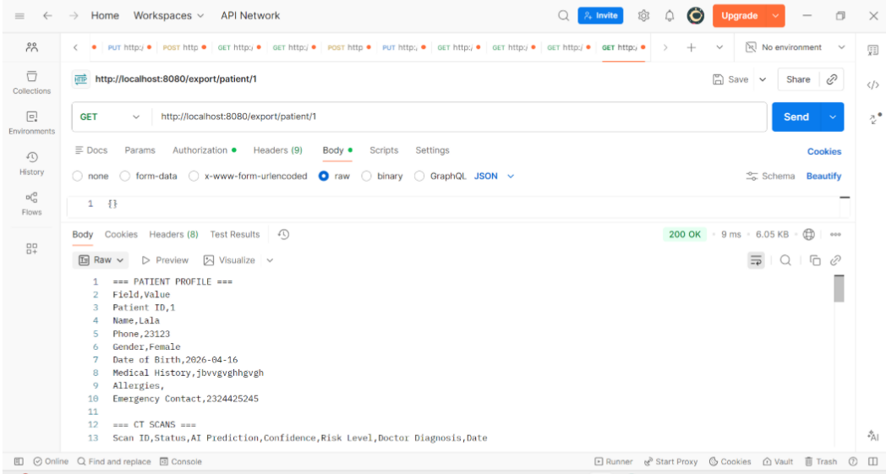
3. 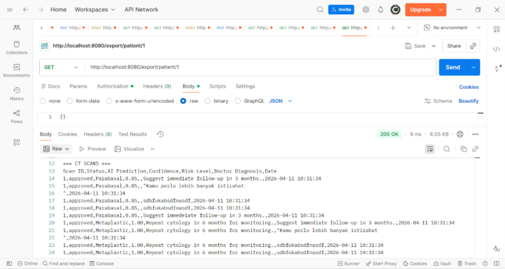
4. 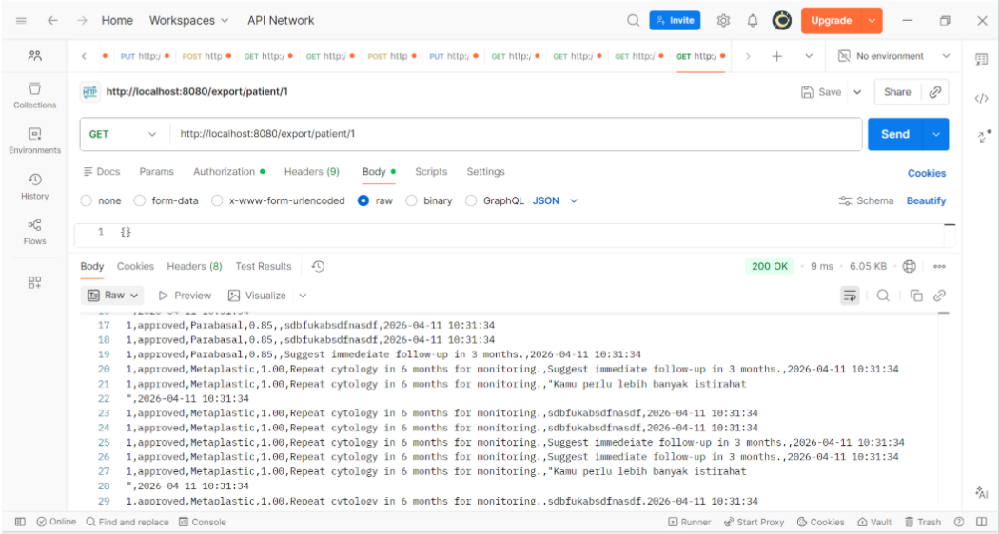
---

**Documentation Report (LO3)**

**Deskripsi Sistem**

Orvella adalah platform berbasis web di bidang kesehatan yang dirancang untuk membantu proses analisis CT Scan dan monitoring kondisi pasien dengan memanfaatkan teknologi Artificial Intelligence (AI).

Sistem ini memungkinkan tenaga medis untuk mengelola data pasien, melakukan analisis CT Scan secara otomatis, memberikan diagnosis, serta memantau kondisi kesehatan pasien secara terstruktur dan efisien.

---

**Tujuan Sistem**

Tujuan dari sistem Orvella adalah:

- Mempercepat proses diagnosis kanker serviks dengan bantuan AI  
- Meningkatkan efisiensi pengelolaan data pasien  
- Membantu tenaga medis dalam pengambilan keputusan medis  
- Menyediakan sistem monitoring kesehatan pasien secara berkelanjutan  

---
**Workflow Sistem Orvella (Berdasarkan Role)**

Workflow sistem Orvella dibagi berdasarkan peran pengguna untuk memastikan setiap proses berjalan sesuai dengan tanggung jawab masing-masing role dalam sistem.

---

**Admin**

1. Admin melakukan login ke sistem  
2. Admin membuat akun user (Doctor, Medrec, Patient) melalui fitur register  
3. Admin mengelola data user (edit & delete user)  
4. Admin mengatur konfigurasi sistem / landing page  
5. Admin melihat hasil CT Scan yang telah dianalisis oleh AI  
6. Admin menetapkan dokter untuk menangani pasien (Assign Doctor)  
7. Admin melakukan approval terhadap hasil diagnosis  
8. Admin memonitor aktivitas sistem melalui fitur analytics  
9. Admin melakukan export data (scan, patient, user) dalam format CSV  
10. Admin logout dari sistem  

---

**Medical Record (Medrec)**

1. Medrec melakukan login ke sistem  
2. Medrec mencari dan memilih data pasien  
3. Medrec mengupload file CT Scan pasien  
4. Medrec menjalankan proses AI analysis pada CT Scan  
5. Sistem mengirim data ke AI API untuk mendapatkan hasil prediksi  
6. Medrec melihat hasil awal analisis AI  
7. Medrec mengassign dokter untuk menangani pasien  
8. Medrec logout dari sistem  

---

**Doctor**

1. Doctor melakukan login ke sistem  
2. Doctor melihat daftar pasien yang telah di-assign  
3. Doctor melihat hasil CT Scan dan hasil analisis AI  
4. Doctor memberikan diagnosis berdasarkan hasil AI dan analisis medis  
5. Doctor menginput data diagnosis ke sistem  
6. Doctor memperbarui status appointment pasien  
7. Doctor melihat riwayat kesehatan (health record) pasien  
8. Doctor dapat melakukan export data pasien  
9. Doctor logout dari sistem  

---

**Patient**

1. Patient melakukan login ke sistem  
2. Patient melihat informasi profil pribadi  
3. Patient melihat hasil CT Scan dan diagnosis yang telah disetujui  
4. Patient melihat data health record dan grafik kesehatan  
5. Patient melakukan request appointment dengan dokter  
6. Patient melihat status appointment  
7. Patient dapat mengunduh data medis pribadi  
8. Patient logout dari sistem  

---

**AI System (External Service)**

1. Sistem menerima file CT Scan dari Medrec  
2. Sistem mengirim data CT Scan ke AI API (`/predict`)  
3. AI memproses data dan menghasilkan prediksi penyakit  
4. Sistem menerima hasil analisis (prediction & confidence)  
5. Hasil dikirim kembali ke sistem untuk digunakan oleh Doctor  

---

**Teknologi yang Digunakan**     

- Web Frontend: Laravel (PHP / Blade)
- Mobile App: React Native (Expo)
- Backend: Go (Gin Framework)  
- Database: MySQL 
- AI Service: External API (Cloudflare Tunnel)  
- Authentication: Token-based authentication  
- API Testing: Postman  

---

**Security**

- Token-based authentication digunakan untuk mengamankan setiap endpoint  
- Role-based authorization untuk membatasi akses berdasarkan user  
- Endpoint sensitif hanya dapat diakses oleh role tertentu  

---

**Keunggulan Sistem**

- Proses diagnosis lebih cepat dengan bantuan AI  
- Sistem terstruktur dan mudah digunakan  
- Data pasien tersimpan secara terpusat  
- Arsitektur modular dan scalable  
- Mendukung export data untuk kebutuhan analisis  

---

**Keterbatasan Sistem**

- Bergantung pada koneksi internet untuk AI  
- Akurasi AI tergantung pada model yang digunakan  
- Belum mendukung notifikasi real-time  

---

**Pengembangan Selanjutnya**

- Penambahan fitur notifikasi real-time  
- Pengembangan aplikasi mobile  
- Peningkatan akurasi model AI  
- Dashboard visual yang lebih interaktif  

---