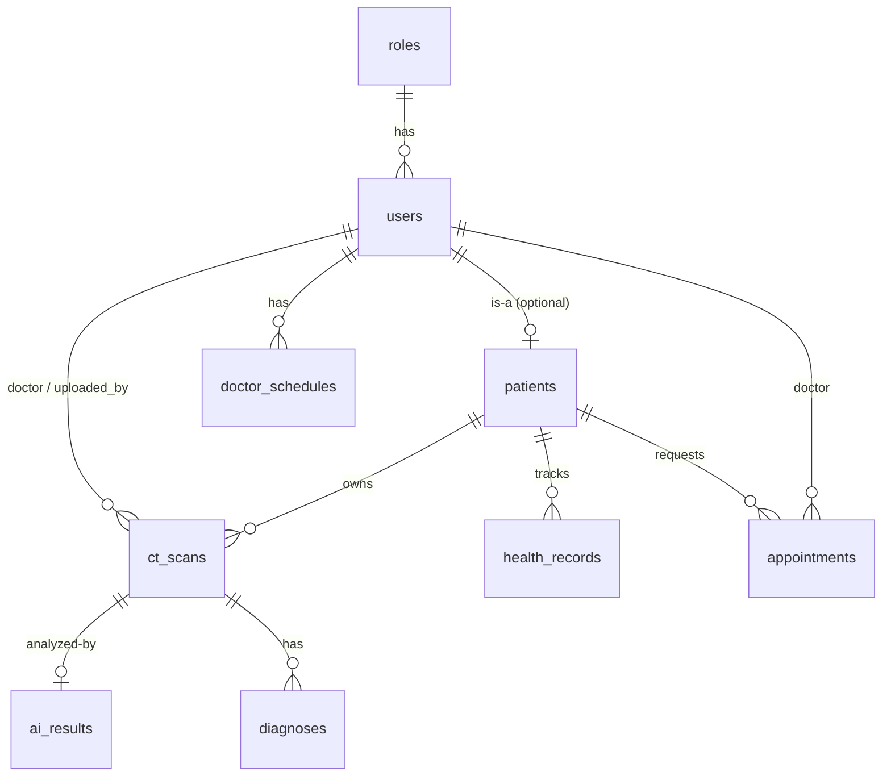
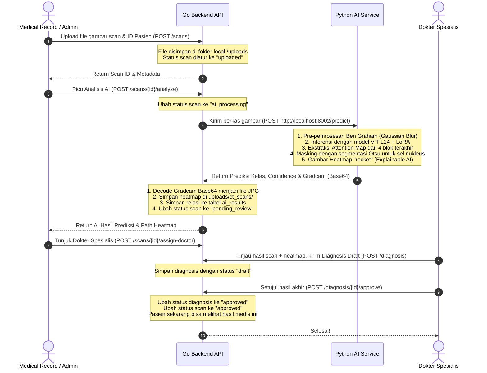

# 🏥 Orvella Backend & AI Service Documentation

Dokumentasi ini menjelaskan arsitektur, alur kerja (workflow), teknologi, database, dan daftar API untuk **Orvella Healthcare System** khususnya pada bagian **Backend (Go)** dan **AI Service (Python FastAPI)**.

---

## 🚀 Sekilas Tentang Sistem

Orvella adalah platform manajemen kesehatan modern yang mengintegrasikan rekam medis dengan sistem analisis citra medis berbasis Kecerdasan Buatan (AI). Sistem ini dirancang untuk mendeteksi anomali sel hasil sitologi pada CT Scan (menggunakan citra mikroskopis sel kanker serviks/sitologi) serta memantau perkembangan kesehatan pasien secara berkala.

Sistem backend terbagi menjadi dua layanan utama:
1. **Go Backend API (Port 8080)**: Mengontrol otentikasi, otorisasi berbasis peran (RBAC), data pasien, pendaftaran janji temu (appointments), jadwal dokter, penyimpanan rekam medis, ekspor data, serta menjadi orkestrator utama.
2. **Python AI Service (Port 8002)**: Layanan inferensi deep learning berbasis FastAPI untuk memprediksi kategori sel dari citra medis dan menghasilkan heatmap visualisasi Explainable AI (XAI).

---

## 🛠️ Stack Teknologi & Tools

### 1. Go Backend (API Gateway & Core Logic)
- **Bahasa**: Go (Golang) versi `1.25.7`
- **Framework Web**: [Gin Gonic](https://github.com/gin-gonic/gin)
- **Database Driver**: `go-sql-driver/mysql` (Menggunakan raw SQL query untuk efisiensi maksimal)
- **Keamanan & Rate Limiting**:
  - `golang.org/x/time/rate` (Membatasi percobaan login/request sensitif)
  - `golang.org/x/crypto/bcrypt` (Hashing password)
  - `github.com/golang-jwt/jwt/v5` & Token Kustom (Otentikasi token)
- **Utilitas**:
  - `github.com/joho/godotenv` (Manajemen env variables)
  - `github.com/google/uuid` (Generasi token unik)

### 2. Python AI Service (Cytology Deep Learning Model)
- **Framework**: FastAPI + Uvicorn
- **Framework ML/DL**: PyTorch (`torch`, `torchvision`)
- **Arsitektur Model**: Vision Transformer (ViT-Large Patch 14) + Parameter-Efficient Fine-Tuning (LoRA via `peft`)
- **Library Pendukung**:
  - `timm` (PyTorch Image Models)
  - `opencv-python` (Pra-pemrosesan citra medis & manipulasi gambar)
  - `seaborn` & `numpy` (Memetakan atensi model menjadi visualisasi heatmap)

### 3. Database & Infrastruktur
- **RDBMS**: MySQL (Nama Database default: `fp4`)
- **Penyimpanan Gambar**: Local filesystem storage (disajikan lewat static route `/uploads`) dengan repositori terisolasi melalui mockup interface S3.

---

## 🔑 Hak Akses & Role Pengguna (RBAC)

Sistem menggunakan kontrol akses berbasis peran (Role-Based Access Control) dengan peran sebagai berikut:

| ID Role | Nama Role | Deskripsi Singkat |
| :---: | :--- | :--- |
| **1** | `Admin` | Mengelola data pengguna (create, edit, delete), konfigurasi sistem, melihat analitik global, mengalokasikan jadwal dokter, dan mengunggah hasil scan. |
| **2** | `Doctor` | Mendiagnosis hasil scan, menandatangani persetujuan (approve/reject), mengisi rekam medis harian, memperbarui status janji temu, dan melihat analitik pribadi. |
| **3** | `Patient` | Pasien yang dapat mendaftar janji temu (appointments), melihat hasil scan miliknya sendiri (yang sudah disetujui dokter), dan memantau riwayat kesehatannya dalam grafik. |
| **4** | `Medical Record` | Staff administrasi medis yang bertanggung jawab mengunggah citra CT Scan baru, memicu analisis AI awal, mengalokasikan dokter penanggung jawab scan, dan mencatat rekam medis awal. |

---

## 📂 Struktur Database (Skema MySQL)

Berikut adalah entitas utama pada database `fp4` berdasarkan file [schema.sql](file:///c:/FinproPPT/Orvella_UTS_PPT-main/backend/db/schema.sql):



### Penjelasan Tabel Utama:
- `roles`: Tabel master peran pengguna (`Admin`, `Doctor`, `Patient`, `Medical Record`).
- `users`: Data login, profil dasar, password hash, dan token aktif.
- `patients`: Ekstensi profil untuk pengguna yang berperan sebagai pasien (berisi data tanggal lahir, riwayat alergi, riwayat medis, dan kontak darurat).
- `ct_scans`: Data unggahan berkas CT Scan yang menghubungkan pasien, pengunggah, dan dokter penanggung jawab.
- `ai_results`: Hasil prediksi otomatis AI beserta tingkat kepercayaan dan tautan heatmap visualisasi.
- `diagnoses`: Catatan diagnosis resmi, catatan dokter, dan status draf/persetujuan dari dokter spesialis.
- `health_records`: Indikator klinis periodik pasien (tekanan darah, detak jantung, suhu, tingkat oksigen, berat badan, skor kesehatan, dan alert status).
- `appointments`: Jadwal pertemuan antara pasien dan dokter.
- `doctor_schedules`: Jam operasional ketersediaan dokter per hari.

---

## 🔄 Alur Kerja Utama Backend (System Workflow)

### 1. Alur Otentikasi & Proteksi Endpoint
1. Pengguna mengirimkan kredensial ke `/login` (dilindungi oleh middleware **Rate Limiting** ketat).
2. Sistem mencocokkan password menggunakan hashing bcrypt.
3. Setelah valid, server membuat UUID token unik yang disimpan di tabel `users` (kolom `token`).
4. Token dikirim kembali ke klien untuk disematkan dalam header `Authorization: Bearer <token>` dan header `X-Client-Type` untuk verifikasi platform.
5. Middleware `AuthMiddleware` memvalidasi keberadaan token di database, dan middleware `RoleMiddleware` membatasi akses berdasarkan array peran yang diizinkan.

---

### 2. Alur Pengunggahan & Analisis AI CT Scan (End-to-End)

Proses dari citra masuk hingga verifikasi medis terdiri dari langkah-langkah berikut:



---

### 3. Alur Rekam Medis (Health Graph) & Alerting
1. Dokter atau Medical Record memasukkan metrik vital pasien melalui `POST /health-records`.
2. Backend secara otomatis menghitung `health_score` berdasarkan parameter medis (tekanan darah, detak jantung, dll.).
3. Jika metrik berada di luar rentang normal, status `alert_status` diubah menjadi `warning` atau `danger` bersama dengan pesan rekomendasi otomatis.
4. Pasien dapat mengakses grafik perkembangan kondisi kesehatannya melalui endpoint `GET /health-records/graph` untuk visualisasi di aplikasi mobile.

---

## ⚙️ Cara Menjalankan Project

### Prasyarat
- **Go** (versi >= 1.18)
- **Python** (versi >= 3.10) dengan dukungan CUDA (opsional, untuk akselerasi GPU)
- **MySQL Server** (XAMPP, Laragon, atau MySQL Standalone)

### Langkah Setup & Run

1. **Konfigurasi Environment Variable**  
   Salin berkas konfigurasi di dalam folder `backend` dan edit isinya di `.env`:
   ```env
   DB_HOST=127.0.0.1
   DB_PORT=3306
   DB_USER=root
   DB_PASSWORD=yourpassword
   DB_NAME=fp4
   JWT_SECRET=supersecretkey_for_testing_123
   FRONTEND_URL=http://localhost:3000
   ```

2. **Inisialisasi Database (Migration & Seeding)**  
   Jalankan perintah berikut di dalam direktori `backend` untuk membuat database `fp4`, menginisialisasi skema tabel, dan mengisi data pengguna bawaan:
   ```bash
   cd backend
   go run cmd/seed/main.go
   ```
   *Setelah selesai, semua akun hasil seed akan memiliki password default: `password123`*

3. **Menjalankan Go Backend API Server**  
   Dari folder `backend`, jalankan server utama:
   ```bash
   go run cmd/api/main.go
   ```
   *Server backend akan mendengarkan pada http://localhost:8080*

4. **Menjalankan Python AI Service**  
   Buka terminal baru, masuk ke direktori `ai-service`, instal dependensi, lalu jalankan aplikasinya:
   ```bash
   cd ai-service
   pip install -r requirements.txt
   python main.py
   ```
   *Layanan AI akan aktif pada http://localhost:8002*

5. **Menjalankan Otomatis dengan Batch Script (Windows)**  
   Anda juga dapat menjalankan seluruh sistem (termasuk Laravel Frontend) sekaligus menggunakan skrip peluncur di root project:
   ```bash
   .\run_orvella.bat
   ```

---

## 📌 Rincian Endpoint API Backend (Orvella API)

Semua endpoint berproteksi memerlukan token autentikasi di header request:  
`Authorization: Bearer <token_anda>` dan header verifikasi platform.

### 1. Endpoint Publik (Tanpa Autentikasi)

| Method | Endpoint | Deskripsi | Rate Limit |
| :--- | :--- | :--- | :--- |
| `GET` | `/` | Mengecek status hidup server backend | Normal |
| `GET` | `/configs` | Mengambil konfigurasi halaman awal (Landing Page) | Normal |
| `POST` | `/login` | Otentikasi pengguna dan mendapatkan token | **Ketat** |
| `POST` | `/forgot-password` | Melakukan reset password | Normal |

### 2. Autentikasi & Pengaturan Akun

| Method | Endpoint | Peran Pengguna (Role) | Deskripsi |
| :--- | :--- | :--- | :--- |
| `GET` | `/me` | `Semua Role` | Mengambil info pengguna yang sedang aktif login |
| `POST` | `/logout` | `Semua Role` | Mengakhiri sesi login (menghapus token aktif) |
| `POST` | `/register` | `Admin` | Mendaftarkan pengguna baru (Doctor, Medrec, Patient) |
| `GET` | `/profile` | `Semua Role` | Mengambil data profil detail pengguna saat ini |
| `PUT` | `/profile` | `Semua Role` | Memperbarui informasi profil pengguna |
| `PUT` | `/profile/complete` | `Semua Role` | Melengkapi profil pengguna untuk pertama kali |

### 3. Manajemen Pengguna & Analitik (Admin & Doctor)

| Method | Endpoint | Peran Pengguna (Role) | Deskripsi |
| :--- | :--- | :--- | :--- |
| `GET` | `/users` | `Admin` | Melihat daftar seluruh pengguna sistem |
| `PUT` | `/users/:id` | `Admin` | Memperbarui data pengguna tertentu berdasarkan ID |
| `DELETE` | `/users/:id` | `Admin` | Menghapus pengguna tertentu dari sistem |
| `GET` | `/doctors` | `Semua Role` | Mengambil daftar dokter spesialis yang tersedia |
| `GET` | `/analytics/admin` | `Admin` | Mengambil metrik analitik dashboard global admin |
| `GET` | `/analytics/doctor/stats` | `Doctor` | Mengambil statistik khusus untuk dokter login |
| `GET` | `/patients` | `Doctor`, `Admin`, `Medical Record` | Melihat seluruh daftar pasien |
| `GET` | `/patients/:id` | `Doctor`, `Admin`, `Medical Record` | Mengambil informasi rekam medis detail pasien tertentu |
| `PUT` | `/patients/:id` | `Doctor`, `Admin`, `Medical Record` | Memperbarui detail profil klinis pasien |

### 4. CT Scan & Analisis AI (Clinical Workflow)

| Method | Endpoint | Peran Pengguna (Role) | Deskripsi |
| :--- | :--- | :--- | :--- |
| `GET` | `/scans` | `Semua Role` | Mengambil data scan (Pasien hanya bisa melihat scan miliknya yang sudah disetujui) |
| `POST` | `/scans` | `Admin`, `Medical Record` | Mengunggah gambar CT Scan baru ke sistem |
| `POST` | `/scans/:id/analyze` | `Admin`, `Medical Record`, `Doctor` | Mengirim gambar ke AI Service untuk diprediksi & dibuat heatmap |
| `POST` | `/scans/:id/assign-doctor` | `Admin`, `Medical Record` | Menugaskan dokter spesialis untuk memeriksa hasil scan |
| `POST` | `/diagnosis` | `Doctor` | Mengirim draf diagnosis dari dokter |
| `PUT` | `/diagnosis/:id/approve`| `Doctor`, `Admin` | Menyetujui hasil diagnosis agar status scan menjadi `approved` |
| `PUT` | `/diagnosis/:id/reject` | `Doctor`, `Admin` | Menolak diagnosis dan mengubah status scan menjadi `rejected` |

### 5. Rekam Medis Berkala (Health Records)

| Method | Endpoint | Peran Pengguna (Role) | Deskripsi |
| :--- | :--- | :--- | :--- |
| `POST` | `/health-records` | `Doctor`, `Admin`, `Medical Record` | Mencatat indikator vital pasien (tensi, gula darah, dll.) |
| `GET` | `/health-records/graph` | `Patient`, `Doctor`, `Admin` | Mengambil deret data vital pasien untuk visualisasi grafik |
| `PUT` | `/health-records/:id` | `Doctor`, `Admin` | Mengubah catatan indikator kesehatan |
| `DELETE` | `/health-records/:id` | `Doctor`, `Admin` | Menghapus catatan indikator kesehatan |

### 6. Janji Temu (Appointments) & Jadwal Dokter

| Method | Endpoint | Peran Pengguna (Role) | Deskripsi |
| :--- | :--- | :--- | :--- |
| `POST` | `/appointments` | `Patient` | Membuat janji temu baru dengan dokter |
| `GET` | `/appointments` | `Patient`, `Doctor` | Mengambil daftar janji temu yang relevan |
| `PUT` | `/appointments/:id/status`| `Doctor` | Memperbarui status janji temu (Disetujui/Ditolak/Selesai) |
| `PUT` | `/appointments/:id/cancel`| `Patient` | Membatalkan janji temu secara mandiri |
| `POST` | `/admin/schedules` | `Admin` | Membuat alokasi jadwal ketersediaan untuk dokter |
| `PUT` | `/admin/schedules/:id`| `Admin` | Memperbarui slot jadwal dokter |
| `DELETE` | `/admin/schedules/:id`| `Admin` | Menghapus slot jadwal dokter |
| `GET` | `/schedules` | `Semua Role` | Mengambil seluruh jadwal dokter |
| `GET` | `/schedules/:doctor_id`| `Semua Role` | Mengambil jadwal spesifik untuk dokter tertentu |

### 7. Ekspor Data (Export to CSV)

| Method | Endpoint | Peran Pengguna (Role) | Deskripsi |
| :--- | :--- | :--- | :--- |
| `GET` | `/export/scans` | `Admin`, `Doctor` | Mengekspor semua metadata scan ke berkas CSV |
| `GET` | `/export/patients` | `Admin`, `Doctor` | Mengekspor daftar semua pasien ke berkas CSV |
| `GET` | `/export/users` | `Admin` | Mengekspor daftar semua pengguna sistem ke berkas CSV |
| `GET` | `/export/patient/:id` | `Admin`, `Doctor` | Mengekspor rekam medis lengkap satu pasien ke berkas CSV |
| `GET` | `/export/doctor/patients` | `Doctor` | Mengekspor daftar pasien yang ditangani oleh dokter login |

---

## 🧪 Detail Response & Prediksi AI

Ketika API `/scans/:id/analyze` dipanggil, AI Service memprediksi sel sitologi ke dalam 5 klasifikasi medis:
1. **Dyskeratotic**: Sel tidak normal, mengindikasikan patologi serius. Tindakan medis: Biopsi & review onkologi mendesak.
2. **Koilocytotic**: Perubahan sel akibat infeksi virus HPV. Tindakan medis: Tes DNA HPV & skrining sekunder.
3. **Metaplastic**: Transformasi sel jinak/adaptif. Tindakan medis: Ulangi sitologi dalam 6 bulan untuk pemantauan.
4. **Parabasal**: Pola sel basal yang dominan. Tindakan medis: Korelasi klinis dengan status hormonal pasien.
5. **Superficial-Intermediate**: Sel epitel normal/sehat. Tindakan medis: Lanjutkan skrining rutin tahunan.
